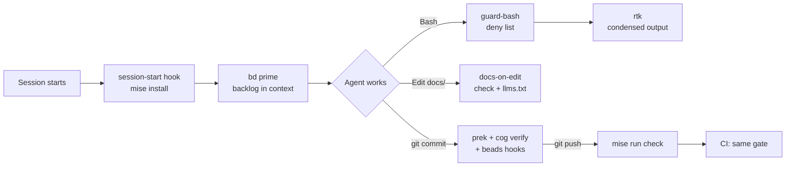

# The agent harness

A coding agent does what its context tells it and what its tools allow. Left
alone in a repository, it installs tools its own way, invents conventions,
forgets what it decided last session and collides with any other agent in the
same checkout. The harness is the set of files that removes each of those
failure modes by construction, so that the quality of the work depends on the
repository rather than on how well each session was prompted.

The rule behind every part: **a convention that is not enforced by a tool is a
suggestion.** Each section below names the failure, the part that prevents it,
and what that part costs.

## One toolchain, declared once

**Failure.** Two agents on two machines run different versions of the same
linter and disagree about whether the tree is clean. A cloud session has none
of the tools installed.

**Part.** `mise.toml` pins every tool and defines every task. The
session-start hook runs `mise install` in cloud sessions, and CI uses the same
file. `mise run check` is the only gate, run the same way by the pre-push hook,
by CI and by an agent before it reports.

**Cost.** Contributors install mise. A tool without a mise backend needs a
fallback; pact has one, see [the toolchain reference](reference/toolchain.md#pact-from-source).
Decision: [0001](decisions/0001-mise-is-the-single-toolchain-entry-point.md).

## Instructions in one place

**Failure.** Claude Code reads `CLAUDE.md`, Codex and Cursor read `AGENTS.md`
or their own rule files. Two copies of the same protocol drift, and nobody can
tell which one is current.

**Part.** `AGENTS.md` holds the protocol. `CLAUDE.md` imports it with
`@AGENTS.md` and adds only what is specific to Claude Code. Tools that write
instruction blocks (beads, pact, rtk) keep them between markers, and
`pact doctor` reports duplicated blocks.

**Cost.** A tool upgrade can re-add a block it considers missing. Run
`pact doctor` after upgrading bd or pact.

## A shared backlog that survives sessions

**Failure.** An agent's plan lives in its context window and disappears with
the session. Markdown TODO lists go stale and conflict on merge.

**Part.** beads (`bd`) is the tracker. The `bd prime` hook loads the ready
work into every session, and agents file follow-ups with `bd create` instead
of leaving notes.

**Cost.** Issues live in a local Dolt database; sharing them across machines
uses `bd dolt push` to a git ref, which is one more thing to sync.

## Coordination between agents in one checkout

**Failure.** Two agents edit the same file; one loses its work. One renames a
function another is about to call.

**Part.** pact gives agents advisory leases on paths, messages addressed to a
path, and watches that deliver a diff when a lease is released. Its protocol
is the pact block in `AGENTS.md`.

**Cost.** Leases are advisory. An agent that ignores the protocol is not
stopped, only visible in `pact log` and `pact audit`.

## Guard rails on commands

**Failure.** An agent pushes to `main`, commits `.env`, skips hooks with
`--no-verify`, or opens an interactive editor and hangs the session.

**Part.** The `guard-bash` hook denies those commands before they run and
tells the agent why. It matches command positions only, so a document that
mentions `git push main` is not blocked.

**Cost.** A deny list is never complete. It holds the mistakes that are both
likely and expensive; anything else is left to review.

## Context spent on signal

**Failure.** Verbose command output (test runners, package managers, long
diffs) fills the context window and pushes out what the agent needs.

**Part.** rtk rewrites Bash commands so their output arrives condensed. It is
wired as a project hook, so every clone and cloud session gets it without
changing the user's global Claude Code settings.

**Cost.** A condensed result can hide a detail. The instruction block tells
the agent to re-run with `rtk proxy <cmd>` when output looks wrong.

## Less code by default

**Failure.** Agents over-build: a dependency for what the standard library
does, an abstraction for one caller.

**Part.** The ponytail plugin is enabled for the project. It pushes toward the
smallest solution that works, and asks for a `ponytail:` comment on every
deliberate shortcut, naming its ceiling and upgrade path, so shortcuts form a
ledger instead of silent debt.

**Cost.** The plugin runs small Node.js hooks. Without `node` on the path the
skills still load but the always-on activation stays quiet.

## Documentation that cannot drift silently

**Failure.** Docs describe last month's behaviour. Agents act on them.

**Part.** The `docs-writer` agent owns the docs and follows the
[style guide](contributing/documentation-style.md). Every page carries
frontmatter that `scripts/docs.py` validates on edit, on commit and in CI, and
`docs/llms.txt` is regenerated from it so the agents' map is never stale.
Decision: [0002](decisions/0002-documentation-is-markdown-with-a-frontmatter-contract.md).

**Cost.** The gate checks structure and links, not truth. Accuracy still needs
a review pass against the code, which is the agent's step 3.

## Scripts anyone can run

**Failure.** Helper scripts in a language half the contributors do not have,
or in Bash that breaks under `dash` on CI.

**Part.** Scripts are POSIX `sh` or Python 3 with the standard library only,
checked by shellcheck and ruff.
Decision: [0003](decisions/0003-scripts-are-posix-sh-or-python.md).

**Cost.** No third-party Python packages in scripts. When one becomes
necessary, the script moves to a `uv`-managed project and the decision is
revisited.
